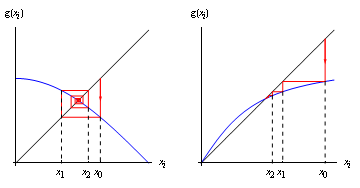
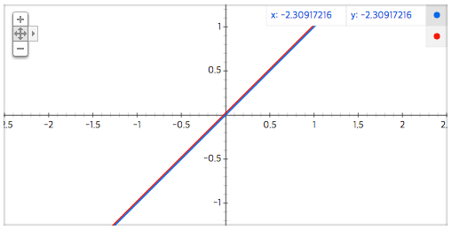
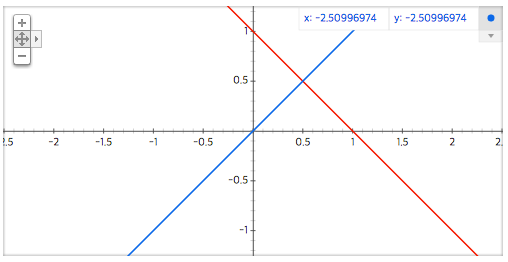
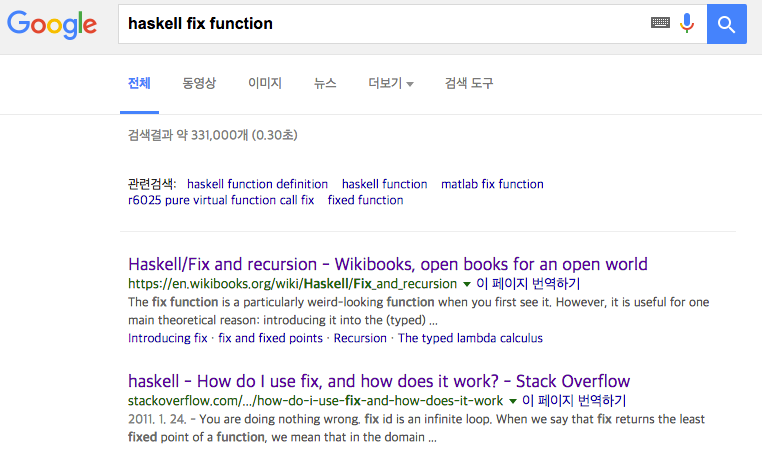
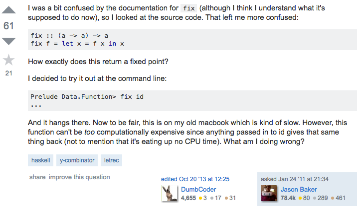
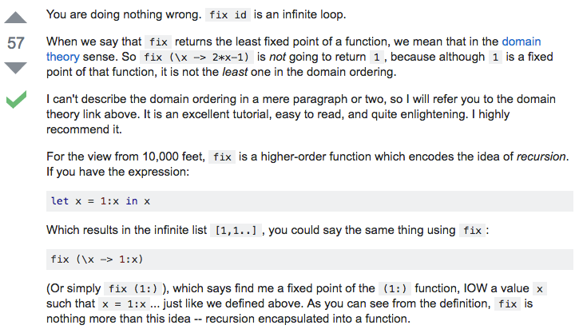
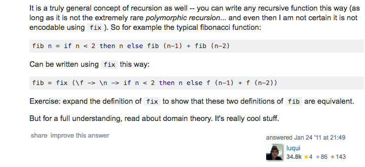
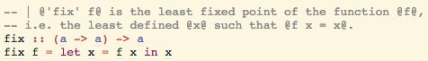

**Data.Function.fix ?** <!-- .element style="font-size:2em;" -->

ㅤ

ㅤ


2016년 8월 30일

이문영

---

### 위치
---

```haskell
Prelude> import Data.Function
Prelude Data.Function> Data.Function.
Data.Function.$      Data.Function..      Data.Function.fix    Data.Function.id
Data.Function.&      Data.Function.const  Data.Function.flip   Data.Function.on
```

---

### 우선 떠오른 것
---

fixed point iteration




( http: //wwwf.imperial.ac.uk/metric/
metric_public/numerical_methods/
iteration/fixed_point_iteration.html
에서 참조했습니다. )

---

### 타입 확인
---

```haskell
Prelude Data.Function> :t fix
fix :: (a -> a) -> a
```

---

### 일단 실행
---

```haskell
Prelude Data.Function> :t fix
fix :: (a -> a) -> a
```

`(a -> a)` 를 인자로 받는 **고차함수** 이므로

일단 `id` 넣고 실행해 보자

----

### 실패
---

```haskell
Prelude Data.Function> fix id
█
```

GHCi 8.0.1 : 끝나지 않는 GHCi 8

----

### 실패
---

```haskell
Prelude Data.Function> fix id
*** Exception: <<loop>>
```

GHCi 7.10.3 : 금방 오류

---

### 착각
---

```haskell
id :: a -> a
id x = x
```

$y=x$



부정

----

### 착각
---

근이 있는 함수

$y=1-x$



---

### *다시* 실행
---

```haskell
Prelude Data.Function> fix (\ x -> 1 - x)
```

----

### *다시* 실행
---

```haskell
Prelude Data.Function> fix (\ x -> 1 - x)
█
```

GHCi 8.0.1 : 끝나지 않는 GHCi 8

---

### 잘 모르면 검색
---

google 에서 검색



----

### 잘 모르면 검색
---

stackoverflow 질문



----

### 잘 모르면 검색
---

stackoverflow 답변



----

### 잘 모르면 검색
---

stackoverflow 답변



---

### 다시 실행
---

```haskell
Prelude Data.Function> :{
Prelude Data.Function| let
Prelude Data.Function|  fib = fix (\f -> \n ->
Prelude Data.Function|   if n < 2 then n else f (n-1) + f (n-2))
Prelude Data.Function| :}
fib :: (Ord a, Num a) => a -> a
```

```haskell
Prelude Data.Function> fib 5
5
it :: (Ord a, Num a) => a
```

```haskell
Prelude Data.Function> map fib [1..10]
[1,1,2,3,5,8,13,21,34,55]
it :: (Ord b, Num b, Enum b) => [b]
```

---

### 타입 *다시* 확인
---

```haskell
Prelude Data.Function> :t fix
fix :: (a -> a) -> a
```

---

### 소스 코드 확인
---

hoogle 에서 검색



---

### 변형!
---

```haskell
fix :: (a -> a) -> a
fix f = let x = f x in x
```
```haskell
fix f = x
```
```haskell
fix f = let (fix f) = f (fix f) in (fix f)
```
```haskell
fix f = f (fix f)
```

----

### 변형!!
---

```haskell
fix :: (a -> a) -> a
fix f = f (fix f)
```

```haskell
f :: (a -> a)
fix f :: a
```

---

### 사용법
---

```haskell
fib = fix (\ f ->
  \ n ->
-- 현재 조건에서 종료 할 수 있는가?
    if n < 2
-- 종료 할 수 있으면 실제 값을 반환
    then n 
-- 종료 할 수 없으면 인자로 들어온 f = fix (\ f -> ...) 를 사용하여 재귀
    else f (n - 1) + f (n - 2)
  )
```

----

### 사용법
---

```haskell
Prelude Data.Function> :t fib
fib :: (Ord a, Num a) => a -> a
```

```haskell
fib = fix (\ f -> \ n -> ...)
-- (\ f -> \ n -> ...) 는 인자 두 개 필요(f, n)
-- (\ f -> \ n -> ...) 의 첫번째 인자인 f 에
--   fix (\ f -> \ n -> ...) 부분 적용
-- fib 는 인자 한 개 필요(n)
```

----

### 사용법
---

```haskell
Prelude Data.Function> fib 11
89
it :: (Ord a, Num a) => a
```

---

### 결론
---

- 타입 확인도 중요하지만 소스 확인도 중요

- haskell 에서 함수는 일급 함수

- 커링된 함수의 부분 적용은 유용
